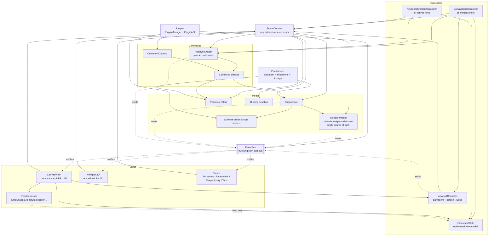
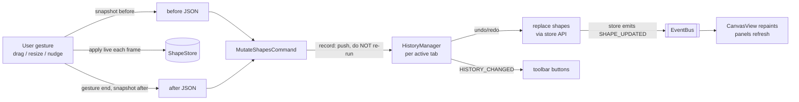
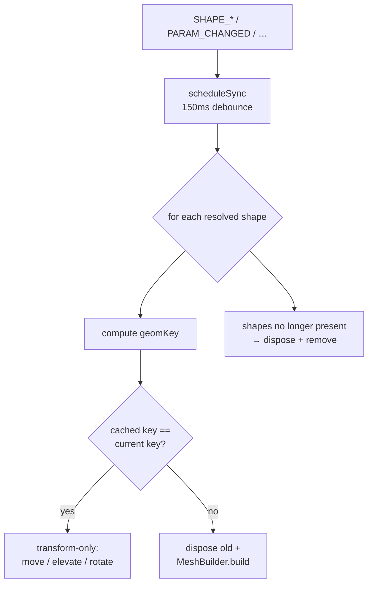

# Otto Architecture

Otto is a browser-based **2.5D parametric design environment**. You draw flat
shapes on a canvas, drive their dimensions with parameters and bindings, give
each piece a `depth` (extrusion) and `z` (elevation), assign woodworking-style
edge joinery, and see the result rebuilt live in an embedded 3D viewport — or
generate the same scene from AQUI code or Blockly blocks.

This document describes the system **after** the MVC / schema / command-system
refactor. If you are looking for the old `CanvasRenderer`, the memento undo
system, or the standalone `assemble.html` assembly page — they are gone. See
the individual sections for what replaced them.

## Table of contents

1. [MVC layering](#1-mvc-layering)
2. [Declarative shape schema](#2-declarative-shape-schema)
3. [Command system and undo](#3-command-system-and-undo)
4. [2.5D: depth and z](#4-25d-depth-and-z)
5. [Live 3D viewport](#5-live-3d-viewport)
6. [Plugins](#6-plugins)
7. [Accessibility](#7-accessibility)
8. [EventBus](#8-eventbus)
9. [Geometry library](#9-geometry-library)
10. [Testing](#10-testing)
11. [Deferred / documented debts](#11-deferred--documented-debts)

---

## Overview

The single most important structural change: the old **3526-line
`CanvasRenderer` god object** — which owned pixels, input, selection, hit
testing, coordinate math, and interaction state all at once — has been
**deleted** and dissolved into a clean Model / View / Controller split. Nothing
holds a long-lived mutable copy of state that another layer also owns; the
`EventBus` is the only cross-layer notification channel.

The layers and their allowed dependencies:



Everything is wired together in `core/Application.js#init()`.

---

## 1. MVC layering

### Model

The model is the source of truth for scene content.

- **Stores** (per scene / per tab): `ShapeStore` (the shape repository +
  joinery map), `ParameterStore` (user parameters), and `BindingResolver`
  (turns a `Binding` into a concrete number). These hang off a `SceneState`.
- **`SelectionModel`** (`core/SelectionModel.js`) is the **single source of
  truth** for everything "selected": shape selection (single + multi via a
  `Set<string>` plus a `primaryId`), edge selection, the `'shape' | 'edge'`
  selection mode, and hover state (hovered shape id, hovered edge). Before this
  class, selection lived in three places at once (ShapeStore's dual fields,
  CanvasRenderer's private copies, PropertiesPanel's cache) that were manually
  re-synced. It does not own shapes — it takes `getShape` / `getAllIds`
  callbacks so it can validate selections and build event payloads without
  holding the shape map. Selection is deliberately **not undoable**.
- **Schema-driven Shape models** (`models/shapes/`): see section 2.

`ShapeStore` keeps thin **backward-compatible delegates** (`selectedShapeId`,
`selectedShapeIds`, `selectionMode`, `hoveredEdge`, `setSelected`, …) that
simply proxy the `SelectionModel`, so pre-refactor call sites (Serializer,
older panels) keep working. New code reaches the model via `SceneContext`.

### Views

- **`CanvasView`** (`views/canvas/CanvasView.js`) is the "V" that remained
  after `CanvasRenderer` was dissolved. It owns *only* the `<canvas>` element,
  its 2D context, HiDPI (devicePixelRatio) sizing, and the
  `requestAnimationFrame` render throttle. Every repaint assembles a fresh
  **`frame`** object and runs the render passes over it:

  ```js
  frame = {
    ctx,             // 2D context, DPR transform pre-applied
    scene,           // active SceneState (shapeStore, parameterStore, …)
    selection,       // SelectionModel (ids, edges, mode, hover)
    viewport,        // live {x, y, zoom} of the active tab
    vc,              // ViewportController (screen↔world, css size, baseZoom)
    interaction,     // InteractionState (drag/resize/path-draw/preview)
    bindingResolver
  }
  ```

  **Passes** are pure draws over the frame and must not mutate stores or
  selection. Render order (unchanged from the monolith):

  `clear → GridPass` (screen space) `→ [apply viewport transform] → ShapesPass
  → JoineryPass → SelectionPass → SelectionRectPass → DragPreviewPass →
  PathDrawPass → HandleEditPass → [restore]`

  The one sanctioned exception: `JoineryPass` rebuilds
  `interaction.joineryHandles` (a hit-test cache) as it draws — that cache is
  derived render output, not model state.

- **`Viewport3D`** — embedded live 3D (section 5).
- **Panel components** — `PropertiesPanel`, `ParametersMenu`, `ShapeLibrary`,
  `TabBar`, `ZoomControls`, `CodeEditor`, `BlocksEditor`, etc.

### Controllers

- **`CanvasInputController`** (`controllers/CanvasInputController.js`) — *all*
  mouse/wheel interaction: click / shift-click / rubber-band selection, single
  and multi drag, corner resize, rotation, right-drag pan, wheel zoom, edge
  hover/select, the joinery menu + depth handles, path free-drawing with bezier
  curves, and post-creation handle editing. It **writes** `InteractionState`,
  calls store/selection methods, records commands, and asks `CanvasView` to
  repaint. It owns no pixels and keeps no selection copies.
- **`KeyboardShortcutController`** (`controllers/KeyboardShortcutController.js`)
  — *all* canvas keys: `E` (toggle edge mode), `Escape` (cascading cancel),
  `Enter` (finish path), arrow-key nudge, `Ctrl/Cmd+A/D`, `Delete`. (App-level
  keys — save/open/undo/redo/new-tab — stay in `Application`.)
- **`ViewportController`** (`controllers/ViewportController.js`) — pan, zoom
  (clamped `[0.1, 5]`), and the `screenToWorld` / `worldToScreen` transforms.
  It reads the per-tab `{x, y, zoom}` viewport through `SceneContext`, and
  computes `baseZoom` (the "100%" that fits a 300 mm × 300 mm work area) on
  resize. Emits `VIEWPORT_CHANGED`; it never calls render directly.
- **`InteractionState`** (`controllers/InteractionState.js`) is the **ephemeral
  view-model** shared controllers → passes: drag/selection-rect/resize/rotation
  /path-draw/handle-edit/preview/joinery-handle state, plus grid + snap
  settings and pressed keys. Never serialized, never in undo history, `reset()`
  wholesale on tab switch. It uses the exact field names the old renderer used
  so ported code reads naturally. `HitTestService` (`services/HitTestService.js`)
  is the pure-query companion: "what shape/edge/handle is at this point?" —
  no mutations, no events, no drawing.

### SceneContext — how tab switches got trivial

`core/SceneContext.js` is a **lazy accessor** of the active tab's scene. Its
getters (`scene`, `shapeStore`, `parameterStore`, `bindingResolver`,
`selection`, `viewport`, `history`) resolve *live* through `TabManager` on every
access. Components hold the `SceneContext`, not the stores, so switching tabs
requires no re-wiring — subscribers to `TAB_SWITCHED` just re-render. This
eliminated the old `Application.updateComponentsForNewScene` field-poking that
had to reach into every component and swap its cached store references on each
switch. (A few older panels still cache stores and are updated explicitly; they
are being migrated to `SceneContext`.)

The `TabManager` source is passed to `SceneContext` as a *function*
(`() => this.tabManager`) because `Application` swaps its `TabManager` instance
on load/import — the closure keeps the context from going stale.

---

## 2. Declarative shape schema

Every concrete shape class declares two statics and nothing more of the
property boilerplate:

```js
export class Circle extends Shape {
    static type = 'circle';
    static SCHEMA = {
        centerX: { type: 'number', default: (o) => o.position?.x ?? 0, bindable: true, translate: 'x', label: 'Center X' },
        centerY: { type: 'number', default: (o) => o.position?.y ?? 0, bindable: true, translate: 'y', label: 'Center Y' },
        radius:  { type: 'number', default: 20, bindable: true, min: 0, label: 'Radius' }
    };
    // geometry only: getBounds(), containsPoint(), render(), toGeometryPath()
}
```

The `Shape` base class (`models/shapes/Shape.js`) **derives everything
property-shaped** from the merged schema — `Shape.fullSchema = { ...SCHEMA,
...COMMON_SCHEMA }` (frozen + cached per class):

- **constructor** — resolves each property from options in priority order
  *direct name → aliases → descriptor default* (the default may be a function of
  the options, letting geometry anchor to the drop `position`);
- `getBindableProperties()` — schema keys where `bindable`, in declaration
  order (drives the Properties Panel field list, `resolve()`, and `toJSON()`);
- `resolve(parameterStore, bindingResolver)` — Template Method: clones the
  shape and overwrites each bound property with its evaluated value; the stored
  shape is never mutated (called once per frame per shape);
- `clone()` / `toOptions()` — deep copy incl. active bindings;
- `translate(dx, dy)` — shifts every property whose descriptor has a
  `translate: 'x' | 'y'` role (replaces the old per-type center-vs-origin
  branching in drag/nudge code);
- `toJSON()` / `fromJSON()` — schema-driven serialization (see below).

**PropertyDescriptor fields** (all in `models/shapes/schema.js`): `type`
(editor hint), `default` (value or `(options) => value`), `bindable`,
`translate` role, `aliases` (AQUI snake_case / legacy names), `min` / `max` /
`step` / `label` / `unit`, `copy` (deep-copier for reference-typed values like
point arrays), `serialize` (JSON transform), `alwaysSerialize` (write the
literal even when bound — used where the value IS the geometry, e.g. Line
endpoints), `omitIfDefault` (skip write when still equal to the static default),
`omitIfNull`.

**`COMMON_SCHEMA`** is merged **after** each class's own schema (so class
properties serialize first, common ones last — preserving the exact 1.0.0 key
order) and adds three properties to *every* shape:

- `rotation` (default `0`) — previously a special case that `toJSON()` silently
  dropped, so rotations did not survive save/load; now bindable, resolved
  generically, and persisted `omitIfDefault`;
- `depth` (default `3` mm, `min 0.5`) and `z` (default `0` mm) — the 2.5D
  properties (section 4).

**Payoff:** adding a property to a shape (or to all shapes) is now **one schema
line** instead of edits to ~5 methods per class (~40 edit sites in the old
design). `ShapeRegistry.registerClass(cls)` registers a shape purely from its
static `type` + `SCHEMA`; a static block registers the 18 built-ins, and the
`SHAPE_TYPE_REGISTERED` event is gated so that bulk registration stays quiet
and only later (plugin) registrations fire it.

---

## 3. Command system and undo

The old memento system — which serialized the **entire scene** ~300 ms after
every event and threw the stack away on tab switch — is **deleted**. Undo is
now a granular command system.

- **`Command`** (`commands/Command.js`) — `execute(scene)` applies a change,
  `undo(scene)` reverts it *exactly*; both may be async. Commands mutate
  **only** through store APIs (so the stores emit their normal events and every
  observer updates for free), capture the state they need as **plain JSON**
  (never live references), and may implement `coalesceWith(next)` to merge rapid
  same-target commands into one history entry. `CompositeCommand` batches
  several commands as one entry.
- **`HistoryManager`** (`commands/HistoryManager.js`) — **per-tab**: each `Tab`
  owns one bound to its `SceneState`, so undo history **survives tab switches**.
  Capped at 100 entries. Three entry paths:
  - `execute(cmd)` — run then push (normal);
  - `record(cmd)` — push **without** running (interactive gestures apply their
    mutations live, frame by frame; the command already captured before/after
    state and just needs to exist for undo/redo);
  - `beginBatch(label)` / `endBatch()` — group into one `CompositeCommand`.

  Emits `HISTORY_CHANGED { canUndo, canRedo, label }` after every mutation, so
  the toolbar undo/redo buttons update **without polling**.



**Command classes:**

| Command | Purpose |
|---|---|
| `AddShapeCommand` | add one shape (live instance first run; rebuilds from JSON on redo) |
| `RemoveShapesCommand` | delete; undo restores paint order, joinery, and selection |
| `DuplicateShapesCommand` | clone (keeps every property + binding), offset (20, 20), select copies |
| `MutateShapesCommand` | **generic gesture**: drags/resizes/rotations/nudges via `{before, after}` snapshots, coalescing |
| `SetBindingCommand` | attach/detach a parameter binding |
| `SetShapePropertyCommand` | set a single property |
| `AddParameterCommand` / `RemoveParameterCommand` | parameters |
| `SetParameterValueCommand` | coalescing (slider drags merge) |
| `UpdateParameterMetaCommand` | rename / min / max / step |
| `SetEdgeJoineryCommand` | assign or clear edge joinery |
| `ReplaceSceneCommand` | whole-scene `{before, after}` for coarse ops (code run, blocks run, clear-all) |

`ReplaceSceneCommand` is the memento-style half of a deliberate **hybrid**: fine
edits are granular commands; operations that rebuild the whole scene capture a
before-snapshot on construction and an after-snapshot via `captureAfter()`, then
are `record()`ed (with an `isNoop()` guard). The viewport is intentionally
excluded from its snapshot.

**`CommandCatalog`** (`commands/CommandCatalog.js`) is a `name → factory`
registry (`shape.add`, `shape.mutate`, `param.setValue`, `scene.replace`, …)
that backs plugin command registration and gives tooling a discoverable list.
It replaces the never-instantiated `CommandRegistry` (whose separate history
stack is superseded by the per-tab `HistoryManager`).

**Policy:** selection changes and viewport changes are **not** commands (not
undoable) — the industry convention. Commands that delete shapes restore
selection as part of their own `undo()`.

---

## 4. 2.5D: depth and z

Otto is a 2.5D environment: each flat piece has a thickness, can float above
the work plane, and can fold up to stand or slope. Three bindable common
properties carry this through the whole stack:

- **`depth`** — extrusion thickness in mm (default `3`, `min 0.5`);
- **`z`** — elevation of the piece's centre off the work plane in mm (default `0`);
- **`tilt`** — fold the piece up out of the table plane in degrees (default `0`
  flat, `90` upright). With yaw (the ordinary 2D `rotation`, applied first via
  Euler order `YXZ`), this lets flat panels become walls and sloped roofs — a
  wall of height `H` stands on the floor at `tilt: 90, z: H/2`. `tilt` is an
  assembly instruction only; the 2D cut part stays flat, so the canvas still
  draws the piece flat and shows the tilt in its selection badge.
- **`facePlane`** — an enum (`xz` flat/default · `xy` front-vertical · `yz`
  side-vertical) choosing which world plane the piece's flat face lies in; the
  extrusion runs perpendicular. A quick base orientation that composes with
  `tilt`/yaw/`z`. Non-bindable, rendered as a dropdown in the Properties panel.
- **`cutDepth`** — how deep the piece's cut/difference features go through the
  material in 3D (`0` = through, the default; `< depth` = a blind pocket that
  deep). `MeshBuilder` renders a pocket as a no-CSG two-layer stack: a solid
  floor (`depth − cutDepth`) plus a walls-with-holes top layer (`cutDepth`).
  Today this applies to female-joinery holes; boolean-`difference` holes need
  multi-contour PathShape support (a documented follow-up) before they cut.
  `facePlane`/`cutDepth` are part of the mesh `geomKey`, so changing them
  rebuilds that piece's geometry (unlike `tilt`/`z`, which are transform-only).

All three are ordinary bindable schema properties, so they flow *automatically*
through: Properties Panel rows, serialization, the Blockly generic-property
blocks, AQUI's `depth:` / `z:` / `tilt:` params, and the 3D viewport. In the
viewport, `tilt`/`z`/`rotation` take the transform-only fast path (excluded
from the geometry key — no rebuild). See `examples/house.aqui` for a worked
standing-house assembly.

**AQUI integration required no lexer/parser change** — `depth:`, `z:`, `tilt:`
are just parameter names travelling the existing generic param path into shape
options, where the schema picks them up like any other dimension.

**2D rendering** paints z-sorted low-`z`-first (`ShapeStore.getResolvedSorted`)
so higher pieces layer on top, and each raised piece (`z > 0`) casts a subtle
**elevation drop-shadow** whose offset grows with `z` (capped). Hit-testing
(`HitTestService.hitTest`) walks the same z-sorted list **topmost-first**, so
the visually-front piece wins the click. The Selection Pass shows a depth/z
badge on the selected shape.

**Persistence:** `Serializer.VERSION` bumped **1.0.0 → 2.0.0** with a real
migration chain (`persistence/Migrations.js`). Because `depth`/`z` are
`omitIfDefault`, a default scene's wire format is **byte-identical to 1.0.0
except the `version` field** — and the 1.0.0 → 2.0.0 migration is a pure version
stamp (the schema supplies the defaults on load; pre-2.0.0 per-shape
`thickness` fields are geometry, e.g. a Cross arm width, and are left
untouched). This byte-stability is guarded by fixtures (section 10).

**STL import (2.5D bridge):** `persistence/StlImporter.js` parses ASCII **and**
binary STL (binary detected by the exact-size rule, not the leading `solid`
text), then flattens the mesh to a **silhouette outline** on a viewing plane
(`xy` top / `xz` front / `yz` side — front/side flip Z so peaks point up), with
the extent along the perpendicular axis carried in as the piece's `depth`.

Two outline methods: `footprint()` = the fast **convex hull** (used for view
selection + as a fallback), and `silhouette()` = the **true, concave-aware
outline** used for the actual import. The silhouette is dependency-free and
robust for any triangle soup (concave parts, separate islands, overlapping
triangles): project → rasterize triangles into a boolean grid → trace the
filled/empty boundary into closed loops → map back to mm → Douglas–Peucker
simplify (so slanted edges are lines, not staircases). The largest loop is the
outline; interior loops are reported as holes (a PathShape is a single contour,
so holes are noted, not represented). `bestPlane()` auto-picks the most
distinctive view (a house imports as its gabled front, not a square); the
import prompt lets the user override the view and set the (unit-less) scale.
`Application.importSTL()` adds that as a closed `PathShape` via
`AddShapeCommand` (undoable), bounding-box-centred on the viewport and then
framed with a fit-to-view — so a 3D model becomes a normal parametric Otto
piece that extrudes back to roughly its original bounding block. Because STL is
**unit-less** (mm, cm, inch, and m files can produce identical numbers, so no
magnitude heuristic can tell them apart), import always confirms a **scale
factor** (`footprint(parsed, scale)` multiplies points + depth uniformly),
pre-filled with `1` for a sane size or a fit-to-work-area suggestion for an
extreme one. The parser, hull, footprint scaling, and scale suggestion are
pure/DOM-free and unit-tested.

---

## 5. Live 3D viewport

The old standalone **`assemble.html` page + `AssemblyApp` are retired**;
`assemble.html` is now a redirect stub pointing at `index.html`.

**`Viewport3D`** (`views/viewport3d/Viewport3D.js`) is an **embedded** 3D panel
that is the live 2.5D model, not a one-shot export:

- **Lazy-loaded** — Three.js (via import map) and the component are imported on
  first open (`Application.toggle3D`), so the 2D editor's initial page load pays
  nothing for the 3D stack. The render loop pauses (`stop()`) when the panel is
  hidden.
- **EventBus-subscribed + debounced sync** — it re-syncs on `SHAPE_*`,
  `PARAM_CHANGED`, `EDGE_JOINERY_CHANGED`, `TAB_SWITCHED`, `SCENE_LOADED`
  (150 ms debounce keeps slider drags smooth).
- **Per-shape `geomKey` cache** — each piece is keyed by shape id and carries a
  `geomKey` fingerprint of everything that affects geometry (type,
  geometry-affecting props, `depth`, joinery — but **not** `z` or `rotation`,
  which are pure transforms).
- **`depth` → `ExtrudeGeometry` depth; `z` → mesh elevation.** In-place layout:
  canvas x → world x, canvas y → world z.
- **Direct manipulation** — left-drag a piece to move it on the work plane;
  the live gesture updates both views and becomes one undoable
  `MutateShapesCommand`. Shift-click extends the shared selection.
- **CAD navigation** — right-drag orbits, middle-drag pans, the wheel zooms,
  and Fit/Iso/Top controls provide stable camera recovery. A container
  `ResizeObserver` keeps the WebGL buffer and camera aspect synchronized as
  either editor sidebar changes width.
- **Automatic framing** — the first open, scene load, and tab switch frame the
  actual piece bounds, preventing valid models from appearing as an empty
  background merely because their canvas coordinates are far from the origin.
- **Lightweight scene** — a neutral ground/grid replaces the textured table
  and legs, reducing geometry and texture allocation while retaining scale,
  axes, shadows, and depth cues.



**`MeshBuilder`** (`views/viewport3d/MeshBuilder.js`) wraps the retained
`AssemblyPieceFactory` — the battle-tested universal `toGeometryPath →
THREE.Shape` converter, including joinery teeth and female holes — rather than
reimplementing it. Its 2.5D contribution is threading each shape's resolved
`depth`/`z` into the factory (instead of the old hardcoded 3 mm) and computing
the `geomKey`.

---

## 6. Plugins

The `PluginManager` is now **instantiated in `Application.init()`** (it was
previously dormant). Plugins are declared by the host page on
`window.OTTO_PLUGINS` (an array of module paths or `Plugin` classes);
`Application.initPlugins()` loads and activates them in the background, then
fires the `app:init` hook.

**`PluginAPI`** (`plugins/PluginAPI.js`) is the stable Facade over the internal
subsystems (EventBus, ShapeRegistry, BindingRegistry, CommandCatalog, and the
`SceneContext` as the live `sceneState`). Key methods:

- **`registerShape`** accepts either a **schema-bearing class**
  (`registerShape(ShapeClass)` → `ShapeRegistry.registerClass`) or the **legacy
  triple** (`registerShape(type, createFn, fromJSONFn)`); registration fires
  `SHAPE_TYPE_REGISTERED`, and `ShapeLibrary` re-renders.
- **`registerCommand(name, CommandClass)`** adapts a command *class* into a
  `CommandCatalog` factory (`(...args) => new CommandClass(...args)`), so
  `new`-based plugins keep working.
- **`executeCommand(name, ...args)`** builds the command from the catalog and
  runs it through the **active tab's history**, so plugin commands participate
  in undo/redo.
- **Hooks** (separate from EventBus): `app:init`, `scene:loaded` (fires on load
  *and* tab switch), `before-save`, `after-save`.

---

## 7. Accessibility

The editor ships with a real accessibility layer, with reusable helpers in
`src/ui/a11y/`:

- **`LiveRegion`** — a polite `aria-live` announcer. Two instances: the
  `#notification-region` (toast/status announcements) and a dedicated
  `#canvas-status` region that announces canvas selection changes
  (e.g. "Circle 3 selected, 1 of 5 shapes").
- **`FocusTrap`** — keeps focus inside modal dialogs (used by the
  `EdgeJoineryMenu`, which is a `role="dialog"`).
- **`RovingTabindex`** — powers the Shape Library as an ARIA
  `listbox`/`option`: arrow keys roam, and Enter/Space add the shape at the
  viewport center by emitting `SHAPE_KEYBOARD_ADD`, which `Application` turns
  into an undoable `AddShapeCommand`.

Plus: ARIA landmarks (`toolbar` / `tablist` / `tabpanel` / `complementary` /
`main`), `aria-label` + `aria-keyshortcuts` on toolbar buttons, a skip link, and
a `.visually-hidden` utility. The left-panel tabs implement full WAI-ARIA
tablist keyboard behavior (Left/Right/Home/End + roving tabindex).

---

## 8. EventBus

`events/EventBus.js` is unchanged in spirit: a **true singleton** (private
static `#instance`, constructor returns the existing instance) pub/sub with
per-callback `try/catch` error isolation and a snapshot-on-emit that makes
subscribe/unsubscribe safe during a dispatch. It remains the **only** channel
between the core/model layer and the UI/view layer.

What changed is the **`EVENTS` catalogue**. Events that were previously
off-catalogue magic strings are now first-class entries
(`SHAPE_DRAG_START` / `SHAPE_DRAG_END`, `DRAG_PREVIEW_UPDATE` /
`DRAG_PREVIEW_CLEAR`), plus new events introduced by the refactor:

`SHAPE_UPDATED`, `SHAPE_TYPE_REGISTERED`, `SHAPE_KEYBOARD_ADD`, `TOOL_CHANGED`,
`HISTORY_CHANGED`, `PARAM_UPDATED`.

---

## 9. Geometry library

`src/geometry/` (a cuttle-geometry port: `Vec` with `x`/`y`, `AffineMatrix` as
a 2×3, `Path`, `Shape`, `Anchor`) is **unchanged and strictly 2D**. The 2.5D
`depth`/`z` concepts live entirely in the **model** layer (COMMON_SCHEMA) and
are consumed by the views (2D shadow/sort, 3D extrude/elevate) — they **never**
enter the geometry library. Shapes build their canonical geometry via
`toGeometryPath()`, the single source shared by bounds, hit-testing, 2D
rendering, and the 3D mesh builder.

---

## 10. Testing

Tests are a **hand-rolled harness** (no external framework), so they run
anywhere:

- **Node:** `node tests/run-node.js` (imports the manifest, runs, exits
  non-zero on failure).
- **Browser:** open `tests/run-tests.html`.

Both runners share one module list (`tests/manifest.js`) and the same
`tests/harness.js`. There are **47 tests across 6 suites**:

| Suite | Focus |
|---|---|
| `serializer-roundtrip.test.js` | wire format + round-trip (7) |
| `shape-schema.test.js` | schema-driven construct/clone/translate/toJSON (12) |
| `canvas-stack.test.js` | MVC canvas stack / passes / frame (4) |
| `commands.test.js` | commands + HistoryManager undo/redo/coalesce (12) |
| `depth-z.test.js` | 2.5D depth/z flow + omit-if-default (8) |
| `plugin-lifecycle.test.js` | plugin load/activate/register/hooks (4) |

The **byte-fixture guards** are the backbone of the wire-format contract:
`tests/fixtures/scene-v1.json` (version `1.0.0`) and `scene-v2.json`
(version `2.0.0`) are loaded via the environment-agnostic `fixture-io.js`
(reads from disk under Node, `fetch` in the browser) and asserted
byte-for-byte, so any accidental change to serialization key order or the
omit-if-default behavior fails loudly.

---

## 11. Deferred / documented debts

These are known, deliberate trade-offs — documented so they are not mistaken
for bugs:

- **Autosave bypasses the storage abstraction.** `StorageManager` writes the
  autosave directly to `localStorage` under the key `nova_otto_autosave`
  (`StorageManager.AUTOSAVE_KEY`) rather than through the
  `StorageBackend` / `StorageFactory` abstraction. Migrating it would change the
  autosave key/format and break every existing local save, so the pluggable
  backends serve export/import and future cloud sync instead.
- **PathKit remains unloaded.** The geometry library's boolean ops use
  fallbacks; the AQUI language's boolean ops use ClipperLib via CDN.
- **Three parallel shape representations exist by design:**
  1. `src/models/shapes/` — the **canonical editor models** (schema-driven,
     this document's section 2);
  2. `src/programming/Shapes.js` — the **interpreter-internal geometry backend**
     for boolean/turtle ops;
  3. the interpreter's **plain duck-typed objects** — a lightweight interchange
     format, re-materialized into model shapes by `CodeRunner` via
     `ShapeRegistry`.
- **`ShapeStore` selection delegates.** `ShapeStore` still exposes thin
  backward-compatible selection accessors/methods that proxy the
  `SelectionModel`; new code should reach the `SelectionModel` through
  `SceneContext`, and the remaining pre-MVC call sites are being migrated off
  the delegates.
- **A few panels still cache stores.** `PropertiesPanel`, `ParametersMenu`, the
  editors, etc. still hold direct store references and are updated by
  `Application.updateComponentsForNewScene` on tab switch; the canvas stack no
  longer needs this (it resolves everything through `SceneContext`). These
  panels migrate to `SceneContext` with the ongoing command-system work.
