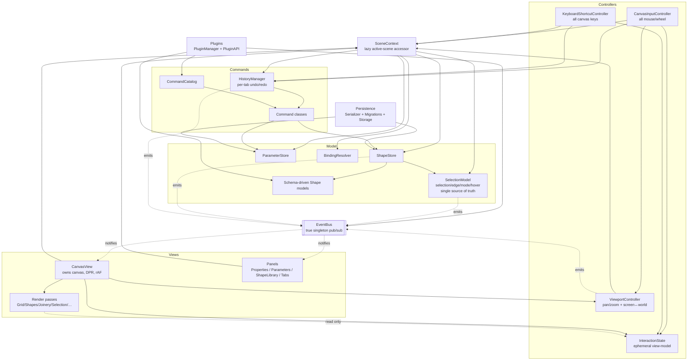
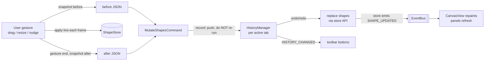

# Otto Architecture

Otto is a browser-based **2.5D parametric design environment**. You draw flat
shapes on a canvas, drive their dimensions with parameters and bindings, give
each piece a `depth` (extrusion) and `z` (elevation), assign woodworking-style
edge joinery, or generate the same scene from AQUI code or Blockly blocks.

This document describes the system **after** the MVC / schema / command-system
refactor. If you are looking for the old `CanvasRenderer`, the memento undo
system, the retired 3D assembly view, or STL import — they are gone. See
the individual sections for what replaced them.

## Table of contents

1. [MVC layering](#1-mvc-layering)
2. [Declarative shape schema](#2-declarative-shape-schema)
3. [Command system and undo](#3-command-system-and-undo)
4. [2.5D: depth and z](#4-25d-depth-and-z)
   - [Jev, the build-up guide](#jev-the-build-up-guide)
5. [Plugins](#5-plugins)
6. [Accessibility](#6-accessibility)
7. [EventBus](#7-eventbus)
8. [Geometry library](#8-geometry-library)
9. [Testing](#9-testing)
10. [Deferred / documented debts](#10-deferred--documented-debts)

---

## Overview

The single most important structural change: the old **3526-line
`CanvasRenderer` god object** — which owned pixels, input, selection, hit
testing, coordinate math, and interaction state all at once — has been
**deleted** and dissolved into a clean Model / View / Controller split. Nothing
holds a long-lived mutable copy of state that another layer also owns; the
`EventBus` is the only cross-layer notification channel.

The layers and their allowed dependencies:


```mermaid
flowchart TD
    subgraph Controllers
        CIC[CanvasInputController<br/>all mouse/wheel]
        KSC[KeyboardShortcutController<br/>all canvas keys]
        VPC[ViewportController<br/>pan/zoom + screen↔world]
        IS[InteractionState<br/>ephemeral view-model]
    end

    subgraph Views
        CV[CanvasView<br/>owns canvas, DPR, rAF]
        PASSES[Render passes<br/>Grid/Shapes/Joinery/Selection/…]
        PANELS[Panels<br/>Properties / Parameters / ShapeLibrary / Tabs]
    end

    subgraph Model
        SM[SelectionModel<br/>selection/edge/mode/hover<br/>single source of truth]
        SS[ShapeStore]
        PS[ParameterStore]
        BR[BindingResolver]
        SHAPES[Schema-driven Shape models]
    end

    subgraph Commands
        HM[HistoryManager<br/>per-tab undo/redo]
        CMDS[Command classes]
        CAT[CommandCatalog]
    end

    SCTX[SceneContext<br/>lazy active-scene accessor]
    EB[[EventBus<br/>true singleton pub/sub]]
    PERS[Persistence<br/>Serializer + Migrations + Storage]
    PLUG[Plugins<br/>PluginManager + PluginAPI]

    CIC --> SCTX & IS & VPC & HM
    KSC --> SCTX & IS & HM
    VPC --> SCTX
    CV --> PASSES
    CV --> SCTX & IS & VPC
    PASSES -. read only .-> IS
    PANELS --> SCTX
    SCTX --> SS & PS & BR & SM & HM
    HM --> CMDS
    CMDS --> SS & PS
    CAT --> CMDS
    SS --> SM
    SS --> SHAPES
    PERS --> SS & PS
    PLUG --> CAT & SHAPES & EB

    SM -. emits .-> EB
    SS -. emits .-> EB
    HM -. emits .-> EB
    VPC -. emits .-> EB
    EB -. notifies .-> CV & PANELS
```

Everything is wired together in `core/Application.js#init()`.

---

## 1. MVC layering

### Model

The model is the source of truth for scene content.

- **Stores** (per scene / per tab): `ShapeStore` (the shape repository +
  joinery map), `ParameterStore` (user parameters), and `BindingResolver`
  (turns a `Binding` into a concrete number). These hang off a `SceneState`.
- **`SelectionModel`** (`core/SelectionModel.js`) is the **single source of
  truth** for everything "selected": shape selection (single + multi via a
  `Set<string>` plus a `primaryId`), edge selection, the `'shape' | 'edge'`
  selection mode, and hover state (hovered shape id, hovered edge). Before this
  class, selection lived in three places at once (ShapeStore's dual fields,
  CanvasRenderer's private copies, PropertiesPanel's cache) that were manually
  re-synced. It does not own shapes — it takes `getShape` / `getAllIds`
  callbacks so it can validate selections and build event payloads without
  holding the shape map. Selection is deliberately **not undoable**.
- **Schema-driven Shape models** (`models/shapes/`): see section 2.

`ShapeStore` keeps thin **backward-compatible delegates** (`selectedShapeId`,
`selectedShapeIds`, `selectionMode`, `hoveredEdge`, `setSelected`, …) that
simply proxy the `SelectionModel`, so pre-refactor call sites (Serializer,
older panels) keep working. New code reaches the model via `SceneContext`.

### Views

- **`CanvasView`** (`views/canvas/CanvasView.js`) is the "V" that remained
  after `CanvasRenderer` was dissolved. It owns *only* the `<canvas>` element,
  its 2D context, HiDPI (devicePixelRatio) sizing, and the
  `requestAnimationFrame` render throttle. Every repaint assembles a fresh
  **`frame`** object and runs the render passes over it:

  ```js
  frame = {
    ctx,             // 2D context, DPR transform pre-applied
    scene,           // active SceneState (shapeStore, parameterStore, …)
    selection,       // SelectionModel (ids, edges, mode, hover)
    viewport,        // live {x, y, zoom} of the active tab
    vc,              // ViewportController (screen↔world, css size, baseZoom)
    interaction,     // InteractionState (drag/resize/path-draw/preview)
    bindingResolver
  }
  ```

  **Passes** are pure draws over the frame and must not mutate stores or
  selection. Render order (unchanged from the monolith):

  `clear → GridPass` (screen space) `→ [apply viewport transform] → ShapesPass
  → JoineryPass → SelectionPass → SelectionRectPass → DragPreviewPass →
  PathDrawPass → HandleEditPass → [restore]`

  The one sanctioned exception: `JoineryPass` rebuilds
  `interaction.joineryHandles` (a hit-test cache) as it draws — that cache is
  derived render output, not model state.

- **Panel components** — `PropertiesPanel`, `ParametersMenu`, `ShapeLibrary`,
  `TabBar`, `ZoomControls`, `CodeEditor`, `BlocksEditor`, etc.

### Controllers

- **`CanvasInputController`** (`controllers/CanvasInputController.js`) — *all*
  mouse/wheel interaction: click / shift-click / rubber-band selection, single
  and multi drag, corner resize, rotation, right-drag pan, wheel zoom, edge
  hover/select, the joinery menu + depth handles, path free-drawing with bezier
  curves, and post-creation handle editing. It **writes** `InteractionState`,
  calls store/selection methods, records commands, and asks `CanvasView` to
  repaint. It owns no pixels and keeps no selection copies.
- **`KeyboardShortcutController`** (`controllers/KeyboardShortcutController.js`)
  — *all* canvas keys: `E` (toggle edge mode), `Escape` (cascading cancel),
  `Enter` (finish path), arrow-key nudge, `Ctrl/Cmd+A/D`, `Delete`. (App-level
  keys — save/open/undo/redo/new-tab — stay in `Application`.)
- **`ViewportController`** (`controllers/ViewportController.js`) — pan, zoom
  (clamped `[0.1, 5]`), and the `screenToWorld` / `worldToScreen` transforms.
  It reads the per-tab `{x, y, zoom}` viewport through `SceneContext`, and
  computes `baseZoom` (the "100%" that fits a 300 mm × 300 mm work area) on
  resize. Emits `VIEWPORT_CHANGED`; it never calls render directly.
- **`InteractionState`** (`controllers/InteractionState.js`) is the **ephemeral
  view-model** shared controllers → passes: drag/selection-rect/resize/rotation
  /path-draw/handle-edit/preview/joinery-handle state, plus grid + snap
  settings and pressed keys. Never serialized, never in undo history, `reset()`
  wholesale on tab switch. It uses the exact field names the old renderer used
  so ported code reads naturally. `HitTestService` (`services/HitTestService.js`)
  is the pure-query companion: "what shape/edge/handle is at this point?" —
  no mutations, no events, no drawing.

### SceneContext — how tab switches got trivial

`core/SceneContext.js` is a **lazy accessor** of the active tab's scene. Its
getters (`scene`, `shapeStore`, `parameterStore`, `bindingResolver`,
`selection`, `viewport`, `history`) resolve *live* through `TabManager` on every
access. Components hold the `SceneContext`, not the stores, so switching tabs
requires no re-wiring — subscribers to `TAB_SWITCHED` just re-render. This
eliminated the old `Application.updateComponentsForNewScene` field-poking that
had to reach into every component and swap its cached store references on each
switch. (A few older panels still cache stores and are updated explicitly; they
are being migrated to `SceneContext`.)

The `TabManager` source is passed to `SceneContext` as a *function*
(`() => this.tabManager`) because `Application` swaps its `TabManager` instance
on load/import — the closure keeps the context from going stale.

---

## 2. Declarative shape schema

Every concrete shape class declares two statics and nothing more of the
property boilerplate:

```js
export class Circle extends Shape {
    static type = 'circle';
    static SCHEMA = {
        centerX: { type: 'number', default: (o) => o.position?.x ?? 0, bindable: true, translate: 'x', label: 'Center X' },
        centerY: { type: 'number', default: (o) => o.position?.y ?? 0, bindable: true, translate: 'y', label: 'Center Y' },
        radius:  { type: 'number', default: 20, bindable: true, min: 0, label: 'Radius' }
    };
    // geometry only: getBounds(), containsPoint(), render(), toGeometryPath()
}
```

The `Shape` base class (`models/shapes/Shape.js`) **derives everything
property-shaped** from the merged schema — `Shape.fullSchema = { ...SCHEMA,
...COMMON_SCHEMA }` (frozen + cached per class):

- **constructor** — resolves each property from options in priority order
  *direct name → aliases → descriptor default* (the default may be a function of
  the options, letting geometry anchor to the drop `position`);
- `getBindableProperties()` — schema keys where `bindable`, in declaration
  order (drives the Properties Panel field list, `resolve()`, and `toJSON()`);
- `resolve(parameterStore, bindingResolver)` — Template Method: clones the
  shape and overwrites each bound property with its evaluated value; the stored
  shape is never mutated (called once per frame per shape);
- `clone()` / `toOptions()` — deep copy incl. active bindings;
- `translate(dx, dy)` — shifts every property whose descriptor has a
  `translate: 'x' | 'y'` role (replaces the old per-type center-vs-origin
  branching in drag/nudge code);
- `toJSON()` / `fromJSON()` — schema-driven serialization (see below).

**PropertyDescriptor fields** (all in `models/shapes/schema.js`): `type`
(editor hint), `default` (value or `(options) => value`), `bindable`,
`translate` role, `aliases` (AQUI snake_case / legacy names), `min` / `max` /
`step` / `label` / `unit`, `copy` (deep-copier for reference-typed values like
point arrays), `serialize` (JSON transform), `alwaysSerialize` (write the
literal even when bound — used where the value IS the geometry, e.g. Line
endpoints), `omitIfDefault` (skip write when still equal to the static default),
`omitIfNull`.

**`COMMON_SCHEMA`** is merged **after** each class's own schema (so class
properties serialize first, common ones last — preserving the exact 1.0.0 key
order) and adds three properties to *every* shape:

- `rotation` (default `0`) — previously a special case that `toJSON()` silently
  dropped, so rotations did not survive save/load; now bindable, resolved
  generically, and persisted `omitIfDefault`;
- `depth` (default `3` mm, `min 0.5`) and `z` (default `0` mm) — the 2.5D
  properties (section 4).

**Payoff:** adding a property to a shape (or to all shapes) is now **one schema
line** instead of edits to ~5 methods per class (~40 edit sites in the old
design). `ShapeRegistry.registerClass(cls)` registers a shape purely from its
static `type` + `SCHEMA`; a static block registers the 18 built-ins, and the
`SHAPE_TYPE_REGISTERED` event is gated so that bulk registration stays quiet
and only later (plugin) registrations fire it.

**Named edges** (`joints/edges.js`) are the attachment points for joints.
Every closed shape has generic names `e0..eN-1` for its straight,
non-zero-length edges. A class can add readable names with
`static edgeNames(shape, edges)`:

| Shape | Names |
|---|---|
| Rectangle, RoundedRectangle, ChamferRectangle, Cross | `top/right/bottom/left` |
| Slot | `top/bottom` |
| Triangle | `base/left/right` |
| Polygon | `side0..`, `bottom` |
| Arrow | `tail` |

Rectangle-like names are found by direction, not index, so a RoundedRectangle
keeps them when its radius changes the anchor layout. Shapes whose straight
segments only approximate a curve (ellipse, arc, donut, gear, spiral, wave)
declare `static curvedOutline = true` and offer no edges. Edge geometry is in
the shape's unrotated coordinates. `toWorld` and `toLocal` apply the canvas
rotation about the bounds centre, and edge hit-testing and edge highlights use
that same rotation.

---

## 3. Command system and undo

The old memento system — which serialized the **entire scene** ~300 ms after
every event and threw the stack away on tab switch — is **deleted**. Undo is
now a granular command system.

- **`Command`** (`commands/Command.js`) — `execute(scene)` applies a change,
  `undo(scene)` reverts it *exactly*; both may be async. Commands mutate
  **only** through store APIs (so the stores emit their normal events and every
  observer updates for free), capture the state they need as **plain JSON**
  (never live references), and may implement `coalesceWith(next)` to merge rapid
  same-target commands into one history entry. `CompositeCommand` batches
  several commands as one entry.
- **`HistoryManager`** (`commands/HistoryManager.js`) — **per-tab**: each `Tab`
  owns one bound to its `SceneState`, so undo history **survives tab switches**.
  Capped at 100 entries. Three entry paths:
  - `execute(cmd)` — run then push (normal);
  - `record(cmd)` — push **without** running (interactive gestures apply their
    mutations live, frame by frame; the command already captured before/after
    state and just needs to exist for undo/redo);
  - `beginBatch(label)` / `endBatch()` — group into one `CompositeCommand`.

  Emits `HISTORY_CHANGED { canUndo, canRedo, label }` after every mutation, so
  the toolbar undo/redo buttons update **without polling**.


```mermaid
flowchart LR
    G[User gesture<br/>drag / resize / nudge] -->|snapshot before| S1[before JSON]
    G -->|apply live each frame| STORE[(ShapeStore)]
    G -->|gesture end, snapshot after| S2[after JSON]
    S1 & S2 --> MC[MutateShapesCommand]
    MC -->|record: push, do NOT re-run| HM[HistoryManager<br/>per active tab]
    HM -->|undo/redo| APPLY[replace shapes<br/>via store API]
    APPLY -->|store emits SHAPE_UPDATED| EB[[EventBus]]
    EB --> REPAINT[CanvasView repaints<br/>panels refresh]
    HM -->|HISTORY_CHANGED| BTN[toolbar buttons]
```

**Command classes:**

| Command | Purpose |
|---|---|
| `AddShapeCommand` | add one shape (live instance first run; rebuilds from JSON on redo) |
| `RemoveShapesCommand` | delete; undo restores paint order, joinery, and selection |
| `DuplicateShapesCommand` | clone (keeps every property + binding), offset (20, 20), select copies |
| `MutateShapesCommand` | **generic gesture**: drags/resizes/rotations/nudges via `{before, after}` snapshots, coalescing |
| `SetBindingCommand` | attach/detach a parameter binding |
| `SetShapePropertyCommand` | set a single property |
| `AddParameterCommand` / `RemoveParameterCommand` | parameters |
| `SetParameterValueCommand` | coalescing (slider drags merge) |
| `UpdateParameterMetaCommand` | rename / min / max / step |
| `SetEdgeJoineryCommand` | assign or clear edge joinery |
| `ReplaceSceneCommand` | whole-scene `{before, after}` for coarse ops (code run, blocks run, clear-all) |

`ReplaceSceneCommand` is the memento-style half of a deliberate **hybrid**: fine
edits are granular commands; operations that rebuild the whole scene capture a
before-snapshot on construction and an after-snapshot via `captureAfter()`, then
are `record()`ed (with an `isNoop()` guard). The viewport is intentionally
excluded from its snapshot.

**`CommandCatalog`** (`commands/CommandCatalog.js`) is a `name → factory`
registry (`shape.add`, `shape.mutate`, `param.setValue`, `scene.replace`, …)
that backs plugin command registration and gives tooling a discoverable list.
It replaces the never-instantiated `CommandRegistry` (whose separate history
stack is superseded by the per-tab `HistoryManager`).

**Policy:** selection changes and viewport changes are **not** commands (not
undoable) — the industry convention. Commands that delete shapes restore
selection as part of their own `undo()`.

---

## 4. 2.5D: depth and z

Otto is a 2.5D environment: each flat piece has a material thickness and can
be elevated above the work plane. Two bindable common properties carry this
through the whole stack:

- **`depth`** — material thickness in mm (default `3`, `min 0.5`);
- **`z`** — elevation of the piece's centre off the work plane in mm (default `0`);

Both are ordinary bindable schema properties, so they flow *automatically*
through: Properties Panel rows, serialization, the Blockly generic-property
blocks, and AQUI's `depth:` / `z:` params.

**AQUI integration required no lexer/parser change** — `depth:` and `z:`
are just parameter names travelling the existing generic param path into shape
options, where the schema picks them up like any other dimension.

**2D rendering** paints z-sorted low-`z`-first (`ShapeStore.getResolvedSorted`)
so higher pieces layer on top, and each raised piece (`z > 0`) casts a subtle
**elevation drop-shadow** whose offset grows with `z` (capped). Hit-testing
(`HitTestService.hitTest`) walks the same z-sorted list **topmost-first**, so
the visually-front piece wins the click. The Selection Pass shows a depth/z
badge on the selected shape.

**Persistence:** `Serializer.VERSION` bumped **1.0.0 → 2.0.0** with a real
migration chain (`persistence/Migrations.js`). Because `depth`/`z` are
`omitIfDefault`, a default scene's wire format is **byte-identical to 1.0.0
except the `version` field** — and the 1.0.0 → 2.0.0 migration is a pure version
stamp (the schema supplies the defaults on load; pre-2.0.0 per-shape
`thickness` fields are geometry, e.g. a Cross arm width, and are left
untouched). This byte-stability is guarded by fixtures (section 10).

### Joints (two-sided, between shapes)

Joints connect two shapes at **named edges** and cut **both** panels. They
live in `SceneState.jointStore` (`core/JointStore.js`):

```
{id, type, a: {shape, edge}, b: {shape, edge}, params}
```

Param values are numbers, enum words, or expression strings over scene
parameters, which stay bound. Every change goes through `joint.add`,
`joint.remove`, `joint.setParams` or `joint.setGround`
(`commands/jointCommands.js`). A change that leaves its joint with an error
(unknown edge, bad parameter) is rejected and rolled back. Deleting a shape
removes its joints, and undo brings them back.

**Joint types** are strategies in `joints/JointRegistry.js`, one file each in
`joints/types/`. A type declares its port kinds, a params schema
(`joints/params.js`), `cut()`, `check()` and `pose()`. Optional hooks:
`preparePorts`, `extraParts` (loose pieces such as wedges), `bom` (hardware)
and `merges` (pieces cut as one).

| Type | Ports | What it cuts |
|---|---|---|
| `finger` | edge + edge | odd count of interlocking teeth at a 90° corner |
| `tab_slot` | face line + edge | slots in A, tabs on B. `lock: wedge` gives longer tabs, wedge holes and wedge pieces |
| `cross_lap` | slot + slot | two slots from opposite edges whose depths add up to the height |
| `splice` | edge + edge (coplanar) | dovetail or round-knob puzzle teeth |
| `bolt` | face line + edge | holes in A, T-slots with nut pockets in B (ISO M3–M6 table), bolts and nuts in the BOM |
| `hinge` | edge + edge | a slitted strip on A as long as the bend; `fabrication/mergePieces.js` joins B to its far side as one piece |

**Ports** (`joints/ports.js`):

| Port | Kind | Meaning |
|---|---|---|
| `shape.edge` | `edge` | a named straight edge |
| `shape.edge.inset(d)` | `line` | a face line d mm inside the edge |
| `shape.edge.at(d)` | `slot` | a slot start d mm along the edge, running straight in |
| `shape.line(x0, y0, x1, y1)` | `line` | an explicit face line |

Offsets accept parameter expressions. Either order of ends may be written;
`resolveParts` orients them to the type's port kinds.

**Pipeline**, pure and cached per scene in `joints/JointService.js`:

```
resolveParts → cut() features → fabrication/CutGeometry.buildAllCuts
```

`resolveParts` turns each jointed shape into a part: a flattened outline in
positive winding, thickness from `depth`, and edge ports. `CutGeometry`
splices the teeth into the outline and merges notches that meet at a corner.
`views/canvas/passes/JointsPass.js` draws the cut outline in place of the
plain one, inside the shape's rotation.

**3D folding** (`joints/JointSolver.js`, `joints/math/Mat4.js`). Joints are
rigid, so placement is exact. The solver walks a spanning tree of the joint
graph from the `ground` shape, which sits at the identity pose (z up), and
composes `T_B · P_B = T_A · P_A · J`:
- `P` is an edge's port frame: x along the edge, y into the material, z
  through the thickness.
- `J = Trans(s, dy, dz) · Rx(φ) · Rz(π)`, with `{s, dy, dz, fold}` from the
  joint type's `pose()`.

Every joint outside the tree closes a loop and is checked. A residual over
0.5 mm or 0.5° becomes a `loop_not_closed` warning that says how far off it
is and in which direction (along the edge, into the panel, or through its
thickness), e.g. "j6 does not close: off by 3.0 mm …". Separate groups of
joined parts are laid side by side.

`fabrication/occupancy.js` samples each joint's contact region in 3D. The
tests require that no point is inside two parts and that no point is inside
neither. This is the geometric proof that the cut teeth really interlock.

**Canvas, inspector and 3D**
- **Join tool** (toolbar *Join*, or `J`): click an edge or a face of one
  shape, then of another.
  - `joints/jointTool.js` (pure) turns each click into a port: an edge click
    becomes `{edge, u}`, and a face click becomes the nearest edge plus an
    inset.
  - It then lists the joints that fit: edge + edge offers finger, splice,
    hinge and cross lap at the clicked points; edge + face offers tab and slot
    or bolt.
  - `controllers/JointToolController.js` shows the choices and runs
    `joint.add`. Escape cancels a pick, then leaves the tool. Edge hit-testing
    takes `{allShapes: true}` here so that a selection does not hide other
    shapes' edges.
- `JointsPass` draws each joint as a dashed, labelled link between its ports,
  plus the tool's picked port (orange) and hovered port (blue).
- **Inspector:** selecting a jointed shape adds a *Joints* section
  (`ui/JointInspector.js`). It has inputs generated from each type's params
  schema, findings, remove, and "stand on the floor".
- **3D preview** (toolbar *3D*, `views/three/Preview3D.js`):
  - three.js 0.186.1 comes from the import map and loads on first open, so the
    2D app never needs it.
  - `views/three/meshSpecs.js` (pure, tested) extrudes each jointed part's
    `cuts3d` outline (flat-only features such as a hinge strip are left out)
    by its thickness, at its solved pose.
  - Parts in a loop that does not close are red, and the reasons are listed.
  - Clicking a part selects its shape. Otto's frames are z-up, so the root is
    turned −90° about x for three.js.

**Fabrication** (toolbar *Cut files*, `ui/CutFilesPanel.js` over
`fabrication/FabricationPlan.js`, pure and tested):
- **Parts.** Every closed shape is a part. Jointed shapes use their cut
  outline, a living-hinge pair becomes one piece (`fabrication/mergePieces.js`),
  and wedges are extra pieces. Plain shapes keep extra closed paths as holes
  (a gear's bore). Open lines are listed as not cut.
- **Kerf.** Outlines grow by kerf/2 and holes shrink by kerf/2
  (`fabrication/polygon.js`).
- **Sheets.** Parts are grouped by thickness and shelf-packed onto bed-sized
  sheets with a 90° rotation where it helps (`fabrication/SheetLayout.js`).
- **SVG.** One file per sheet in mm, with a red 0.01 mm cut layer and an
  optional blue label layer (`fabrication/SvgExporter.js`, `data-part`
  attributes).
- **Report.** A bill of materials (bolts, nuts, wedges) and problems to fix
  first: parts larger than the bed, with the usable area and a splice
  suggestion; joint errors; loops that do not close.
- **Settings.** Bed, kerf, margin, gap and labels live in
  `jointStore.fabrication` (saved with the scene) and are changed with the
  undoable `joint.setFabrication`.

All built-in examples fit the default 600 × 400 bed, and a test enforces it.

**Language and blocks.** AQUI gains two statements:

```
join finger base.top wall.bottom { count: n * 2 + 1 fit: loose }
ground base
```

`join` and `ground` are contextual: they are statements only when a name
follows, so programs that use them as names keep working. Edge names may be
lexer keywords (`left`, `right`).

`JoinVisitor` collects joint records:
- Enum words stay words.
- At top level, an expression over global parameters is kept as text, so the
  joint stays bound to those parameters.
- Inside loops and functions, values are evaluated, and a shape name refers to
  the shape created in the same iteration.

`CodeRunner` (given `getScene`) replaces the scene's joints inside the code
run's `ReplaceSceneCommand` and reports joints that do not resolve. Canvas
→ code emits `join` / `ground` lines (`joints/jointCode.js`).
`joints/jointBlocks.js` generates one Blockly block per joint type from its
params schema, plus a `ground` block, in a "Joints" toolbox category, in both
directions.

**Examples.** The left panel's *Examples* tab (`ui/ExamplesPanel.js`) shows
one card per program in `src/examples/jointExamples.js`: open box, shelf,
stool, splice and hinge, egg-crate loop, and "mistakes on purpose". Opening a
card loads it into the Code tab, runs it and switches to that tab. Your own
code is replaced only after a confirmation. `tests/unit/examples.test.js` checks that every example
runs, that all but the last are free of joint errors and warnings, and that
the last shows exactly its intended problems.

The legacy single-sided `edgeJoinery` (edge menu) still works unchanged.

**Persistence:** `Serializer.VERSION` is 3.0.0. Tabs carry `joints` (and
`ground`) only when there are any. The 2.0.0 → 3.0.0 migration is a version
stamp, and the byte fixture `scene-v3.json` differs from `scene-v2.json` only
in that line.

### Jev, the build-up guide

Jev (`src/jev/`) is a rule-based decision agent that builds the design
with the user, block by block, rather than only commenting on it. It uses
no language model and no network. A block is
a Lego step: one or two panels plus the joints that click them onto what is
already there, and a sentence on why that joint suits that connection.

```
JevOverlay (ui) ──send / accept / reject──▶ JevSession ──onText / onApplied / onRejected──▶ Guide
                                            ◀── effects: {say} {plan} {ask} {propose} ──┘
                                            ▼
              propose → dryRun on a copy → Policy → shown (Apply / Reject) or auto-applied
              apply   → jev/actions → the same undoable commands as code, canvas, blocks
                        (one history batch per proposal = one Ctrl+Z)
```

- **Never edits directly.** Every change is a proposal. It is dry-run on a
  serialized copy first, showing new and fixed problems, then applied as one
  undo step.
- **Policy** (`jev/policy.js`, a study variable) sets how much Jev may do by
  itself:
  - conservative: always asks;
  - balanced: auto-applies only low-risk fixes;
  - autopilot: applies anything that adds no problem, but asks before removals.
- **The guide** (`jev/guide/Guide.js`) decides what comes next. It reads the
  goal with `goal.js` ("a shelf 80 cm tall with 3 boards"), picks a recipe
  from `blueprints.js` (box, shelf, stool), sets the plan, and proposes the
  next block. The session carries out its effects; tests swap in a scripted
  guide.
- **Progress comes from the design itself.** A block counts as done when its
  panels and joints are in the scene, whoever placed them. Joints match by
  type and ports, in either order. Each proposal contains only what is still
  missing. `JevSession.syncPlan()` re-ticks the plan on every scene change,
  so undo un-ticks it.
- **Rejecting a block** with an offered alternative acts at once (*Other
  joint* cycles the block's variants, e.g. wedged tabs / plain tabs / bolts;
  *Skip*). A plain reject asks: skip, other joint, change size (resizes
  placed panels in one proposal), or stop.
- **Built into the canvas** (`ui/JevOverlay.js`, no button, no side panel):
  - a plan strip at the top, with the live design check (problems after
    every change, Jev's or the user's) and settings (policy, log export);
  - the **ghost**: `jev/ghost.js` diffs the proposal's dry-run copy against
    the design, and `JevPreviewPass` draws new panels (with their real teeth
    and slots), panels that gain cuts, and new joint links, dashed in blue,
    exactly where Apply will put them;
  - the proposal card pinned under the ghost: Apply (⏎), the proposal's
    `alternatives` (one click: e.g. *Other joint*, *Skip*), ✕ to reject;
  - an "Ask Jev" bar at the bottom with Jev's latest line, questions as
    chips; it hides to a pill.
- **SessionLog** records every message, state change, proposal and decision
  with timings. *Export session log* saves it as JSON lines.

To add a recipe, add one entry to `BLUEPRINTS`. `tests/unit/jevGuide.test.js`
builds every recipe and every block variant through the session and requires
zero problems at the end.

---

## 5. Plugins

The `PluginManager` is now **instantiated in `Application.init()`** (it was
previously dormant). Plugins are declared by the host page on
`window.OTTO_PLUGINS` (an array of module paths or `Plugin` classes);
`Application.initPlugins()` loads and activates them in the background, then
fires the `app:init` hook.

**`PluginAPI`** (`plugins/PluginAPI.js`) is the stable Facade over the internal
subsystems (EventBus, ShapeRegistry, BindingRegistry, CommandCatalog, and the
`SceneContext` as the live `sceneState`). Key methods:

- **`registerShape`** accepts either a **schema-bearing class**
  (`registerShape(ShapeClass)` → `ShapeRegistry.registerClass`) or the **legacy
  triple** (`registerShape(type, createFn, fromJSONFn)`); registration fires
  `SHAPE_TYPE_REGISTERED`, and `ShapeLibrary` re-renders.
- **`registerCommand(name, CommandClass)`** adapts a command *class* into a
  `CommandCatalog` factory (`(...args) => new CommandClass(...args)`), so
  `new`-based plugins keep working.
- **`executeCommand(name, ...args)`** builds the command from the catalog and
  runs it through the **active tab's history**, so plugin commands participate
  in undo/redo.
- **Hooks** (separate from EventBus): `app:init`, `scene:loaded` (fires on load
  *and* tab switch), `before-save`, `after-save`.

---

## 6. Accessibility

The editor ships with a real accessibility layer, with reusable helpers in
`src/ui/a11y/`:

- **`LiveRegion`** — a polite `aria-live` announcer. Two instances: the
  `#notification-region` (toast/status announcements) and a dedicated
  `#canvas-status` region that announces canvas selection changes
  (e.g. "Circle 3 selected, 1 of 5 shapes").
- **`FocusTrap`** — keeps focus inside modal dialogs (used by the
  `EdgeJoineryMenu`, which is a `role="dialog"`).
- **`RovingTabindex`** — powers the Shape Library as an ARIA
  `listbox`/`option`: arrow keys roam, and Enter/Space add the shape at the
  viewport center by emitting `SHAPE_KEYBOARD_ADD`, which `Application` turns
  into an undoable `AddShapeCommand`.

Plus: ARIA landmarks (`toolbar` / `tablist` / `tabpanel` / `complementary` /
`main`), `aria-label` + `aria-keyshortcuts` on toolbar buttons, a skip link, and
a `.visually-hidden` utility. The left-panel tabs implement full WAI-ARIA
tablist keyboard behavior (Left/Right/Home/End + roving tabindex).

---

## 7. EventBus

`events/EventBus.js` is unchanged in spirit: a **true singleton** (private
static `#instance`, constructor returns the existing instance) pub/sub with
per-callback `try/catch` error isolation and a snapshot-on-emit that makes
subscribe/unsubscribe safe during a dispatch. It remains the **only** channel
between the core/model layer and the UI/view layer.

What changed is the **`EVENTS` catalogue**. Events that were previously
off-catalogue magic strings are now first-class entries
(`SHAPE_DRAG_START` / `SHAPE_DRAG_END`, `DRAG_PREVIEW_UPDATE` /
`DRAG_PREVIEW_CLEAR`), plus new events introduced by the refactor:

`SHAPE_UPDATED`, `SHAPE_TYPE_REGISTERED`, `SHAPE_KEYBOARD_ADD`, `TOOL_CHANGED`,
`HISTORY_CHANGED`, `PARAM_UPDATED`.

---

## 8. Geometry library

`src/geometry/` (a cuttle-geometry port: `Vec` with `x`/`y`, `AffineMatrix` as
a 2×3, `Path`, `Shape`, `Anchor`) is **unchanged and strictly 2D**. The 2.5D
`depth`/`z` concepts live entirely in the **model** layer (COMMON_SCHEMA) and
are consumed by the 2D views for shadowing and sort order — they **never**
enter the geometry library. Shapes build their canonical geometry via
`toGeometryPath()`, the single source shared by bounds, hit-testing, and 2D
rendering.

---

## 9. Testing

Tests are a **hand-rolled harness** (no external framework), so they run
anywhere:

- **Node:** `node tests/run-node.js` (imports the manifest, runs, exits
  non-zero on failure).
- **Browser:** open `tests/run-tests.html`.

Both runners share one module list (`tests/manifest.js`) and the same
`tests/harness.js`. There are **47 tests across 6 suites**:

| Suite | Focus |
|---|---|
| `serializer-roundtrip.test.js` | wire format + round-trip (7) |
| `shape-schema.test.js` | schema-driven construct/clone/translate/toJSON (12) |
| `canvas-stack.test.js` | MVC canvas stack / passes / frame (4) |
| `commands.test.js` | commands + HistoryManager undo/redo/coalesce (12) |
| `depth-z.test.js` | 2.5D depth/z flow + omit-if-default (8) |
| `plugin-lifecycle.test.js` | plugin load/activate/register/hooks (4) |

The **byte-fixture guards** are the backbone of the wire-format contract:
`tests/fixtures/scene-v1.json` (version `1.0.0`) and `scene-v2.json`
(version `2.0.0`) are loaded via the environment-agnostic `fixture-io.js`
(reads from disk under Node, `fetch` in the browser) and asserted
byte-for-byte, so any accidental change to serialization key order or the
omit-if-default behavior fails loudly.

---

## 10. Deferred / documented debts

These are known, deliberate trade-offs — documented so they are not mistaken
for bugs:

- **Autosave bypasses the storage abstraction.** `StorageManager` writes the
  autosave directly to `localStorage` under the key `nova_otto_autosave`
  (`StorageManager.AUTOSAVE_KEY`) rather than through the
  `StorageBackend` / `StorageFactory` abstraction. Migrating it would change the
  autosave key/format and break every existing local save, so the pluggable
  backends serve export/import and future cloud sync instead.
- **PathKit remains unloaded.** The geometry library's boolean ops use
  fallbacks; the AQUI language's boolean ops use ClipperLib via CDN.
- **Three parallel shape representations exist by design:**
  1. `src/models/shapes/` — the **canonical editor models** (schema-driven,
     this document's section 2);
  2. `src/programming/Shapes.js` — the **interpreter-internal geometry backend**
     for boolean/turtle ops;
  3. the interpreter's **plain duck-typed objects** — a lightweight interchange
     format, re-materialized into model shapes by `CodeRunner` via
     `ShapeRegistry`.
- **`ShapeStore` selection delegates.** `ShapeStore` still exposes thin
  backward-compatible selection accessors/methods that proxy the
  `SelectionModel`; new code should reach the `SelectionModel` through
  `SceneContext`, and the remaining pre-MVC call sites are being migrated off
  the delegates.
- **A few panels still cache stores.** `PropertiesPanel`, `ParametersMenu`, the
  editors, etc. still hold direct store references and are updated by
  `Application.updateComponentsForNewScene` on tab switch; the canvas stack no
  longer needs this (it resolves everything through `SceneContext`). These
  panels migrate to `SceneContext` with the ongoing command-system work.
